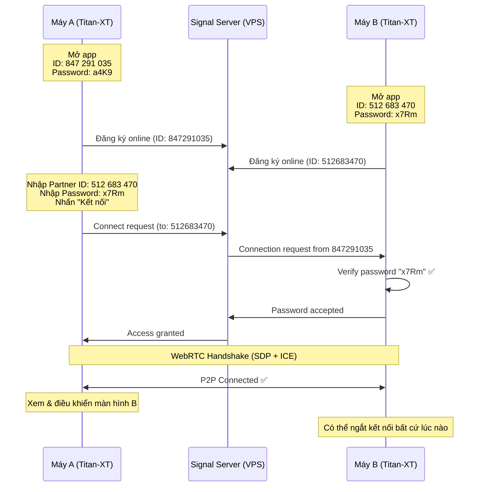
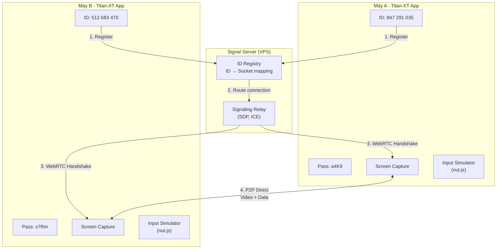

# Titan-XT — Remote Desktop Support Tool (v3 - Final)

Phần mềm hỗ trợ từ xa — **giống TeamViewer**: mỗi máy có **ID + Password**, nhập ID & mật khẩu máy kia để điều khiển.

## Flow hoạt động (giống TeamViewer)



---

## Giao diện chính (TeamViewer-style)

```
┌──────────────────────────────────────────────────────────┐
│  ◆ TITAN-XT                                    ─  □  ×  │
│  Remote Desktop Support                                  │
│                                                          │
│  ┌─────────────────────────┐ ┌─────────────────────────┐ │
│  │   THÔNG TIN CỦA BẠN    │ │   ĐIỀU KHIỂN MÁY KHÁC  │ │
│  │                         │ │                         │ │
│  │   Your ID               │ │   Partner ID            │ │
│  │  ┌───────────────────┐  │ │  ┌───────────────────┐  │ │
│  │  │  847  291  035    │  │ │  │                   │  │ │
│  │  └───────────────────┘  │ │  └───────────────────┘  │ │
│  │          [📋 Copy]      │ │                         │ │
│  │                         │ │   Password              │ │
│  │   Password              │ │  ┌───────────────────┐  │ │
│  │  ┌───────────────────┐  │ │  │                   │  │ │
│  │  │  a4K9       [🔄]  │  │ │  └───────────────────┘  │ │
│  │  └───────────────────┘  │ │                         │ │
│  │                         │ │  ┌───────────────────┐  │ │
│  │   ● Sẵn sàng kết nối   │ │  │  🔗 KẾT NỐI       │  │ │
│  │                         │ │  └───────────────────┘  │ │
│  │                         │ │                         │ │
│  │   Chế độ kết nối:       │ │  ○ Điều khiển từ xa    │ │
│  │   🌐 Internet  🏠 LAN  │ │  ○ Chỉ xem             │ │
│  │                         │ │  ○ Truyền file          │ │
│  └─────────────────────────┘ └─────────────────────────┘ │
│                                                          │
│  ┌──────────────────────────────────────────────────────┐ │
│  │  📋 Lịch sử kết nối gần đây                         │ │
│  │  ┌────────┬──────────────┬────────────┬───────────┐  │ │
│  │  │ ID     │ Tên máy      │ Lần cuối   │           │  │ │
│  │  ├────────┼──────────────┼────────────┼───────────┤  │ │
│  │  │ 512..  │ PC-VanPhong  │ 2 giờ trước│ [Kết nối] │  │ │
│  │  │ 391..  │ Laptop-KH01  │ Hôm qua   │ [Kết nối] │  │ │
│  │  └────────┴──────────────┴────────────┴───────────┘  │ │
│  └──────────────────────────────────────────────────────┘ │
│                                                          │
│  ⚙ Cài đặt                              📊 v1.0.0      │
└──────────────────────────────────────────────────────────┘
```

---

## Kiến trúc



---

## Proposed Changes

### Cấu trúc thư mục

```
Titan-XT/
├── package.json                     # Root workspace
│
├── server/                          # Signal Server (VPS)
│   ├── package.json
│   ├── tsconfig.json
│   └── src/
│       ├── index.ts                 # Express + Socket.io
│       ├── registry.ts              # ID → Socket mapping
│       ├── signaling.ts             # WebRTC signaling relay
│       └── types.ts
│
├── app/                             # Unified Electron App
│   ├── package.json
│   ├── electron-builder.yml
│   ├── tsconfig.json
│   ├── vite.config.ts
│   │
│   ├── src/
│   │   ├── main/                    # Electron Main Process
│   │   │   ├── index.ts             # App entry, window management
│   │   │   ├── preload.ts           # Context bridge (IPC)
│   │   │   ├── identity.ts          # Machine ID + Password generation
│   │   │   ├── screen-capture.ts    # desktopCapturer + multi-monitor
│   │   │   ├── input-simulator.ts   # nut.js mouse/keyboard
│   │   │   ├── file-transfer.ts     # File send/receive
│   │   │   ├── lan-server.ts        # Built-in LAN signaling
│   │   │   ├── store.ts             # Persistent settings (electron-store)
│   │   │   └── tray.ts              # System tray
│   │   │
│   │   ├── renderer/                # UI
│   │   │   ├── index.html
│   │   │   ├── main.ts
│   │   │   ├── styles/
│   │   │   │   ├── global.css       # Design system
│   │   │   │   ├── home.css         # Main screen
│   │   │   │   ├── session.css      # Remote session
│   │   │   │   └── components.css   # Shared components
│   │   │   ├── pages/
│   │   │   │   ├── home.ts          # ID/Password + Connect UI
│   │   │   │   └── session.ts       # Remote control view
│   │   │   ├── components/
│   │   │   │   ├── id-display.ts    # Show Your ID (formatted)
│   │   │   │   ├── connect-form.ts  # Partner ID + Password input
│   │   │   │   ├── monitor-picker.ts
│   │   │   │   ├── toolbar.ts       # Session controls
│   │   │   │   ├── chat-panel.ts
│   │   │   │   ├── file-panel.ts
│   │   │   │   ├── history-list.ts  # Recent connections
│   │   │   │   └── status-bar.ts
│   │   │   └── lib/
│   │   │       ├── webrtc.ts        # WebRTC wrapper
│   │   │       ├── input-handler.ts # Mouse/keyboard capture
│   │   │       ├── connection.ts    # Signal server client
│   │   │       └── events.ts        # Event bus
│   │   │
│   │   └── shared/
│   │       ├── constants.ts
│   │       ├── protocol.ts          # Data channel messages
│   │       └── types.ts
│   │
│   └── resources/
│       ├── icon.ico
│       ├── icon.png
│       └── tray-icon.png
│
└── README.md
```

---

### Phase 1: Identity System (Giống TeamViewer)

#### [NEW] [app/src/main/identity.ts](file:///e:/GitHub/Titan-XT/app/src/main/identity.ts)

**Machine ID** (9 chữ số, persistent):
```typescript
// Tạo từ hardware fingerprint (MAC address + hostname + disk serial)
// Lưu vào electron-store, không thay đổi sau lần đầu
import { machineIdSync } from 'node-machine-id';
import crypto from 'crypto';

function generateMachineId(): string {
  const raw = machineIdSync();
  const hash = crypto.createHash('sha256').update(raw).digest('hex');
  // Lấy 9 chữ số từ hash
  const num = parseInt(hash.substring(0, 12), 16) % 999999999;
  return num.toString().padStart(9, '0');
  // Format hiển thị: "847 291 035"
}
```

**Password** (4 ký tự, random, có thể đổi):
```typescript
function generatePassword(): string {
  const chars = 'abcdefghjkmnpqrstuvwxyz23456789';
  // 4 ký tự → 810,000 tổ hợp (đủ an toàn cho session)
  return Array.from({ length: 4 }, () => 
    chars[crypto.randomInt(chars.length)]
  ).join('');
}
```

#### [NEW] [app/src/main/store.ts](file:///e:/GitHub/Titan-XT/app/src/main/store.ts)
- Sử dụng `electron-store` để lưu persistent data:
  - `machineId`: ID cố định
  - `password`: Password hiện tại
  - `connectionHistory`: Lịch sử kết nối gần đây
  - `settings`: Cài đặt app (quality, startup, etc.)

---

### Phase 2: Signal Server

#### [NEW] [server/src/index.ts](file:///e:/GitHub/Titan-XT/server/src/index.ts)
- Express + Socket.io
- HTTPS support (production)
- Rate limiting

#### [NEW] [server/src/registry.ts](file:///e:/GitHub/Titan-XT/server/src/registry.ts)
```typescript
// Machine ID → Socket mapping
class Registry {
  // Khi app mở: register(machineId, socketId)
  register(machineId: string, socketId: string): void;
  
  // Khi app đóng: unregister
  unregister(machineId: string): void;
  
  // Check online status
  isOnline(machineId: string): boolean;
  
  // Get socket for routing
  getSocket(machineId: string): string | null;
}
```

#### [NEW] [server/src/signaling.ts](file:///e:/GitHub/Titan-XT/server/src/signaling.ts)

Connection flow:
```
1. Máy A gửi: { event: 'connect-request', targetId: '512683470', password: 'x7Rm' }
2. Server tìm socket của 512683470, relay request
3. Máy B verify password locally → gửi: { event: 'connect-response', accepted: true }
4. Server relay response về Máy A
5. Bắt đầu WebRTC signaling (SDP + ICE relay)
6. P2P connected → Server không còn relay data
```

> [!IMPORTANT]
> **Password KHÔNG được gửi qua server dạng plaintext.** Flow an toàn:
> 1. Máy B gửi challenge (random nonce) cho Máy A
> 2. Máy A hash: `SHA256(password + nonce)` → gửi hash
> 3. Máy B verify: so sánh hash
> → Server không bao giờ biết password

---

### Phase 3: Electron App Core

#### [NEW] [app/src/main/index.ts](file:///e:/GitHub/Titan-XT/app/src/main/index.ts)
- BrowserWindow: 850×620, custom titlebar, dark theme
- Auto-register với signal server khi app start
- System tray: minimize to tray, quick actions
- Single instance lock (chỉ cho phép 1 instance)
- Auto-start with Windows (optional setting)

#### [NEW] [app/src/main/preload.ts](file:///e:/GitHub/Titan-XT/app/src/main/preload.ts)
```typescript
contextBridge.exposeInMainWorld('titanAPI', {
  // Identity
  getIdentity: () => ipcRenderer.invoke('identity:get'),        // { id, password }
  regeneratePassword: () => ipcRenderer.invoke('identity:newPass'),
  
  // Connection
  connectTo: (partnerId, password) => ipcRenderer.invoke('connect:request', partnerId, password),
  onConnectionRequest: (cb) => ipcRenderer.on('connect:incoming', cb),
  respondConnection: (accepted) => ipcRenderer.invoke('connect:respond', accepted),
  disconnect: () => ipcRenderer.invoke('connect:disconnect'),
  
  // Screen
  getMonitors: () => ipcRenderer.invoke('screen:monitors'),
  getStream: (monitorId) => ipcRenderer.invoke('screen:stream', monitorId),
  
  // Input simulation
  simulateInput: (event) => ipcRenderer.invoke('input:simulate', event),
  
  // File transfer
  selectFiles: () => ipcRenderer.invoke('file:select'),
  saveFile: (name, data) => ipcRenderer.invoke('file:save', name, data),
  
  // Settings & History
  getHistory: () => ipcRenderer.invoke('history:get'),
  getSettings: () => ipcRenderer.invoke('settings:get'),
  updateSettings: (s) => ipcRenderer.invoke('settings:update', s),
});
```

---

### Phase 4: Screen Capture & Remote Control

#### [NEW] [app/src/main/screen-capture.ts](file:///e:/GitHub/Titan-XT/app/src/main/screen-capture.ts)
- `desktopCapturer.getSources({ types: ['screen'] })`
- Multi-monitor: list all monitors với thumbnail
- Capture constraints: adjustable FPS (15/30/60) & resolution
- Adaptive quality dựa trên bandwidth

#### [NEW] [app/src/main/input-simulator.ts](file:///e:/GitHub/Titan-XT/app/src/main/input-simulator.ts)
- `@nut-tree/nut-js` cho mouse & keyboard simulation
- Coordinate scaling (ratio-based từ viewer → actual screen)
- Support: move, click, dblclick, rightclick, scroll
- Support: keydown, keyup, key combos (Ctrl+C, Alt+Tab, Win+D, etc.)
- Keyboard layout mapping

#### [NEW] [app/src/renderer/lib/webrtc.ts](file:///e:/GitHub/Titan-XT/app/src/renderer/lib/webrtc.ts)
- RTCPeerConnection management
- ICE servers: Google STUN + Open Relay TURN (dev)
- Data Channels:
  - `input` — mouse/keyboard events (unreliable, low latency)
  - `chat` — text messages (reliable, ordered)
  - `file` — file transfer (reliable, ordered)
  - `system` — resolution, ping, clipboard (reliable)
- Connection quality monitoring (RTCStatsReport)

#### [NEW] [app/src/renderer/lib/input-handler.ts](file:///e:/GitHub/Titan-XT/app/src/renderer/lib/input-handler.ts)
- Capture mouse/keyboard events on video element
- Scale: `(mouseX / videoElement.width) * remoteScreenWidth` → ratio 0-1
- Mouse move throttle: 60fps max
- Keyboard: prevent browser defaults, send raw key events
- Special handling: Ctrl+Alt+Del, Alt+Tab, Print Screen

---

### Phase 5: File Transfer & Chat

#### [NEW] [app/src/main/file-transfer.ts](file:///e:/GitHub/Titan-XT/app/src/main/file-transfer.ts)
- Chunk-based: 16KB chunks qua Data Channel
- Protocol: offer → accept/reject → chunks → complete
- Progress tracking, pause/resume, cancel
- Multiple files simultaneously
- Max file size: 2GB

#### [NEW] [app/src/renderer/components/chat-panel.ts](file:///e:/GitHub/Titan-XT/app/src/renderer/components/chat-panel.ts)
- Slide-in sidebar
- Message bubbles, timestamps
- Notification badge khi có tin mới
- Sound notification

#### [NEW] [app/src/renderer/components/file-panel.ts](file:///e:/GitHub/Titan-XT/app/src/renderer/components/file-panel.ts)
- Drag-and-drop zone
- Progress bars (animated)
- File list: name, size, status, actions
- Open received files

---

### Phase 6: UI/UX Premium Design

#### Connection Request Dialog (phía bị kết nối)
```
┌──────────────────────────────────────┐
│                                      │
│  ⚠️  Yêu cầu kết nối                │
│                                      │
│  Máy "PC-KyThuat" (847 291 035)     │
│  muốn điều khiển máy tính của bạn    │
│                                      │
│  Chế độ: Điều khiển hoàn toàn        │
│                                      │
│  ┌──────────┐  ┌──────────────────┐  │
│  │  ❌ Từ chối │  │  ✅ Cho phép     │  │
│  └──────────┘  └──────────────────┘  │
│                                      │
│  □ Luôn cho phép máy này             │
└──────────────────────────────────────┘
```

> [!NOTE]
> Khi có password đúng, kết nối sẽ tự động (không cần confirm).
> Dialog này chỉ hiện khi bật setting "Yêu cầu xác nhận thủ công".

#### Settings Panel
```
┌──────────────────────────────────────┐
│  ⚙ Cài đặt                          │
│                                      │
│  🔒 Bảo mật                         │
│  ├ Password: a4K9  [🔄 Đổi mới]     │
│  ├ □ Yêu cầu xác nhận thủ công      │
│  └ □ Chỉ cho phép IP cụ thể         │
│                                      │
│  🖥️ Hiển thị                         │
│  ├ Chất lượng: [Tự động ▾]          │
│  ├ FPS: [30 ▾]                      │
│  └ □ Ẩn hình nền khi bị điều khiển  │
│                                      │
│  🌐 Kết nối                          │
│  ├ Server: wss://your-vps.com       │
│  └ □ Khởi động cùng Windows          │
│                                      │
│  [Lưu]                [Hủy]         │
└──────────────────────────────────────┘
```

#### Design System (Dark Premium)
```css
/* Colors */
--bg-primary: #0a0a0f;
--bg-secondary: #12121a;
--bg-card: rgba(255, 255, 255, 0.03);
--bg-glass: rgba(255, 255, 255, 0.06);
--accent-cyan: #00d4ff;
--accent-purple: #7c3aed;
--accent-gradient: linear-gradient(135deg, #00d4ff, #7c3aed);
--success: #22c55e;
--warning: #f59e0b;
--danger: #ef4444;
--text-primary: #f0f0f5;
--text-secondary: #8888a0;

/* Glass Effect */
backdrop-filter: blur(20px);
background: rgba(255, 255, 255, 0.04);
border: 1px solid rgba(255, 255, 255, 0.08);

/* Typography */
font-family: 'Inter', system-ui, sans-serif;
```

---

## Tech Stack

| Component | Technology |
|-----------|-----------|
| Desktop App | Electron 33+ |
| Renderer Build | Vite 6+ |
| Language | TypeScript 5.5+ |
| Input Automation | @nut-tree/nut-js |
| Machine ID | node-machine-id |
| Persistent Storage | electron-store |
| Streaming | WebRTC (Chromium built-in) |
| Signal Server | Node.js + Express + Socket.io |
| LAN Signaling | ws (WebSocket) |
| Packaging | electron-builder |
| UI | Vanilla CSS + Inter font |

---

## Verification Plan

### Build & Test
```bash
# Signal server
cd server && npm install && npm run build && npm start

# Electron app  
cd app && npm install && npm run dev   # Dev mode
cd app && npm run build                # Production build
cd app && npm run package              # Package .exe
```

### Manual Test Scenarios
1. **Identity**: App khởi động → hiện ID 9 số + Password 4 ký tự
2. **Register**: App kết nối signal server → trạng thái "Online"
3. **Connect**: Nhập partner ID + password → kết nối thành công < 5s
4. **Screen share**: Xem màn hình máy kia, smooth
5. **Remote control**: Chuột + phím hoạt động chính xác
6. **Bidirectional**: Đổi chiều — máy kia điều khiển ngược lại
7. **Multi-monitor**: Chọn được monitor cụ thể
8. **File transfer**: Kéo thả file, progress bar, nhận file thành công
9. **Chat**: Gửi/nhận tin nhắn real-time
10. **Disconnect**: Ngắt kết nối clean, không crash
11. **LAN mode**: Kết nối trực tiếp IP, không qua signal server
12. **Reconnect**: Mất mạng → tự reconnect
